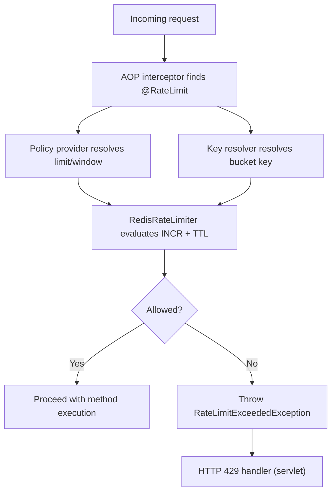

# Spring Boot Redis RateLimiter Starter

[](https://github.com/v4runsharma/spring-boot-starter-redis-ratelimiter/actions/workflows/ci.yml)


A lightweight Spring Boot starter for annotation-driven rate limiting backed by Redis.

This starter provides a production-focused, log-and-metrics-friendly approach to request throttling and complements API Gateway-level rate limiting by enabling method-level protection inside services.

## Features

- `@RateLimit` annotation for method-level and class-level throttling
- Redis fixed-window implementation using `INCR` + TTL (no Lua scripts)
- Automatic Spring Boot 3.x auto-configuration
- HTTP `429` mapping with optional `Retry-After` and `RateLimit-*` headers
- Pluggable key resolution strategy (`RateLimitKeyResolver`)
- Pluggable policy resolution strategy (`RateLimitPolicyProvider`)
- Configurable backend behavior (`fail-open` or `fail-closed`)
- Micrometer metrics support for allowed, blocked, and error outcomes
- Test setup split between unit tests and Docker-backed integration tests

## Why This Starter

In distributed systems, not all limits belong at the edge. Internal service methods often need their own protection based on business keys, tenants, users, or operation type.

This starter standardizes method-level rate limiting so teams avoid duplicating AOP, Redis keying logic, HTTP handling, and metrics wiring in every service.

## Installation

Add the dependency:

```xml
<dependency>
  <groupId>io.github.v4runsharma</groupId>
  <artifactId>spring-boot-starter-redis-ratelimiter</artifactId>
  <version>1.0-SNAPSHOT</version>
</dependency>
```

Requirements:

- Java 17+
- Spring Boot 3.x
- Redis available to your app

## Quick Start

1. Add the dependency.
2. Configure your Redis connection (standard Spring Boot Redis properties).
3. Add `@RateLimit` to service methods.
4. Run the application.

### Example

```java
import io.github.v4runsharma.ratelimiter.annotation.RateLimit;
import java.util.concurrent.TimeUnit;
import org.springframework.stereotype.Service;

@Service
public class BillingService {

  @RateLimit(
      name = "invoice-create",
      scope = "USER",
      limit = 10,
      duration = 1,
      timeUnit = TimeUnit.MINUTES
  )
  public String createInvoice(String accountId) {
    return "ok";
  }
}
```

## Default Behavior

Out of the box, the starter:

- Resolves policy from `@RateLimit` annotation values
- Resolves key using default strategy:
  - `scope + ":" + annotation.key` if `key` is present
  - otherwise `scope + ":" + targetClass#method`
- Applies fixed-window Redis rate limiting
- Throws `RateLimitExceededException` when blocked
- Returns HTTP `429` with `ProblemDetail` in servlet apps
- Publishes Micrometer metrics when `MeterRegistry` is present

## Configuration

All properties are optional.

| Property | Default | Description |
|---|---|---|
| `ratelimiter.enabled` | `true` | Enables/disables starter auto-configuration. |
| `ratelimiter.redis-key-prefix` | `ratelimiter` | Prefix used for Redis bucket keys. |
| `ratelimiter.fail-open` | `false` | If `true`, allows requests when Redis is unavailable. |
| `ratelimiter.include-http-headers` | `true` | Adds `Retry-After` and `RateLimit-*` headers to `429` responses. |
| `ratelimiter.metrics-enabled` | `true` | Enables Micrometer metrics recorder when registry is present. |

Example:

```properties
ratelimiter.enabled=true
ratelimiter.redis-key-prefix=ratelimiter
ratelimiter.fail-open=false
ratelimiter.include-http-headers=true
ratelimiter.metrics-enabled=true
```

## HTTP Response Behavior

When a call is rate limited:

- Status: `429 Too Many Requests`
- Body: RFC7807 `ProblemDetail`
- Optional headers:
  - `Retry-After`
  - `RateLimit-Limit`
  - `RateLimit-Remaining`
  - `RateLimit-Reset`

## Metrics

When Micrometer is available and enabled:

- `ratelimiter.requests` counter (`outcome=allowed|blocked`)
- `ratelimiter.errors` counter
- `ratelimiter.evaluate.latency` timer

## How It Works (High Level)



## Testing

- Unit tests: `mvn test`
- Integration tests (Testcontainers): `mvn verify -DrunITs=true`

Notes:

- Integration tests are in `*IT` classes and run through Maven Failsafe.
- Local integration testing requires a running Docker engine (for example Docker Desktop on macOS).

## Compatibility

- Java 17+
- Spring Boot 3.x
- Redis (tested with Redis 7 via Testcontainers image)

## Relationship to API Gateway Rate Limiting

This starter does not replace gateway throttling. It is intended to:

- Complement edge limits with in-service business limits
- Protect expensive internal operations
- Enforce operation-specific throttles near business logic

## Release to Maven Central

Prerequisites:

- Sonatype OSSRH account with publishing access for `io.github.v4runsharma`
- GPG key configured locally
- Credentials in `~/.m2/settings.xml` for server id `ossrh`
- GPG passphrase configured (environment variable or Maven settings)

Example `~/.m2/settings.xml` snippet:

```xml
<settings>
  <servers>
    <server>
      <id>ossrh</id>
      <username>${env.OSSRH_USERNAME}</username>
      <password>${env.OSSRH_TOKEN}</password>
    </server>
  </servers>
</settings>
```

### Snapshot release

Use a `-SNAPSHOT` version (for example `1.0.1-SNAPSHOT`) and run:

```bash
mvn -DskipTests clean deploy
```

### Staged release

1. Set a non-snapshot version (for example `1.0.1`).
2. Run:

```bash
mvn -DperformRelease=true -Prelease -DskipTests clean deploy
```

3. Close and release the staging repository in Sonatype.

## License

Apache License 2.0

## Contributing

Issues and pull requests are welcome.
