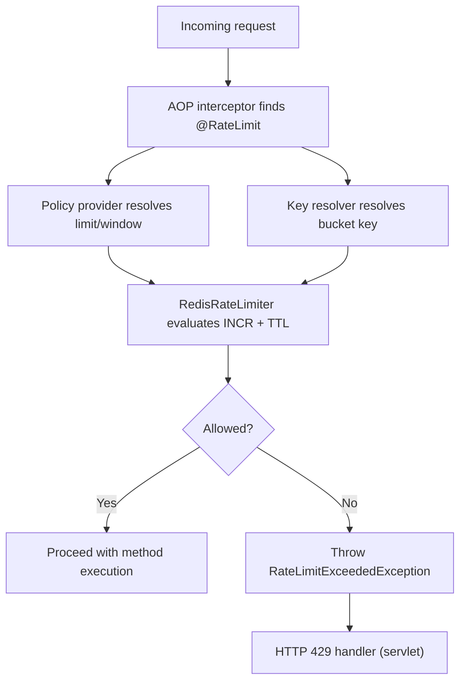

# Spring Boot Redis RateLimiter Starter

[](https://github.com/v4runsharma/spring-boot-starter-redis-ratelimiter/actions/workflows/ci.yml)


A lightweight Spring Boot starter for annotation-driven rate limiting backed by Redis.

This starter provides a production-focused, log-and-metrics-friendly approach to request throttling and complements API Gateway-level rate limiting by enabling method-level protection inside services.

## Table of Contents

- [Features](#features)
- [Why This Starter](#why-this-starter)
- [Requirements](#requirements)
- [Quick Start](#quick-start)
  - [1. Add Dependency](#1-add-dependency)
  - [2. Configure Redis](#2-configure-redis)
  - [3. Add `@RateLimit` to Service Methods](#3-add-ratelimit-to-service-methods)
- [Understanding Keying](#understanding-keying)
- [Per-User Example with Custom Key Resolver](#per-user-example-with-custom-key-resolver)
- [Class-Level Annotation](#class-level-annotation)
- [What Happens When the Limit Is Exceeded](#what-happens-when-the-limit-is-exceeded)
- [Configuration](#configuration)
- [Metrics](#metrics)
- [How It Works](#how-it-works)
- [Quick Validation Checklist](#quick-validation-checklist)
- [Testing](#testing)
- [Compatibility](#compatibility)
- [Relationship to API Gateway Rate Limiting](#relationship-to-api-gateway-rate-limiting)
- [Release to Maven Central](#release-to-maven-central)
- [License](#license)
- [Contributing](#contributing)

## Features

- `@RateLimit` annotation for method-level and class-level throttling
- Redis fixed-window implementation using `INCR` + TTL (no Lua scripts)
- Automatic Spring Boot 3.x auto-configuration (no manual AOP wiring)
- HTTP `429` mapping with optional `Retry-After` and `RateLimit-*` headers
- Pluggable key resolution strategy (`RateLimitKeyResolver`)
- Pluggable policy resolution strategy (`RateLimitPolicyProvider`)
- Configurable backend behavior (`fail-open` or `fail-closed`)
- Micrometer metrics support for allowed, blocked, and error outcomes
- Test setup split between unit tests and Docker-backed integration tests

## Why This Starter

In distributed systems, not all limits belong at the edge. Internal service methods often need their own protection based on business keys, tenants, users, or operation type.

This starter standardizes method-level rate limiting so teams avoid duplicating AOP, Redis keying logic, HTTP handling, and metrics wiring in every service.

## Requirements

- Java 17+
- Spring Boot 3.x
- Redis reachable from your app

## Quick Start

### 1. Add Dependency

Maven (`pom.xml`):

```xml
<dependency>
  <groupId>io.github.v4run-sharma</groupId>
  <artifactId>spring-boot-starter-redis-ratelimiter</artifactId>
  <version>1.0.1</version>
</dependency>
```

Gradle:

```gradle
implementation("io.github.v4run-sharma:spring-boot-starter-redis-ratelimiter:1.0.1")
```

### 2. Configure Redis

`application.yml`:

```yaml
spring:
  data:
    redis:
      host: localhost
      port: 6379
```

Local Redis with Docker:

```bash
docker run --name redis-ratelimiter -p 6379:6379 -d redis:7-alpine
```

### 3. Add `@RateLimit` to Service Methods

```java
import io.github.v4runsharma.ratelimiter.annotation.RateLimit;
import java.util.concurrent.TimeUnit;
import org.springframework.stereotype.Service;

@Service
public class BillingService {

  @RateLimit(
      name = "invoice-create",
      scope = "GLOBAL",
      limit = 10,
      duration = 1,
      timeUnit = TimeUnit.MINUTES
  )
  public String createInvoice(String accountId) {
    return "ok";
  }
}
```

## Understanding Keying

By default, the starter resolves keys like this:

- If `key` is set on the annotation: `scope:key`
- If `key` is not set: `scope:fully.qualified.ClassName#methodName`

`scope` is a label, not identity by itself. If you need per-user or per-tenant limits, use a custom `RateLimitKeyResolver`.

## Per-User Example with Custom Key Resolver

```java
import io.github.v4runsharma.ratelimiter.core.RateLimitContext;
import io.github.v4runsharma.ratelimiter.key.RateLimitKeyResolver;
import org.springframework.stereotype.Component;

@Component
public class UserIdKeyResolver implements RateLimitKeyResolver {
  @Override
  public String resolveKey(RateLimitContext context) {
    Object[] args = context.getArguments();
    String userId = String.valueOf(args[0]); // Example: first argument is userId
    return "user:" + userId + ":" + context.getMethod().getName();
  }
}
```

Use it in the annotation:

```java
@RateLimit(
    name = "invoice-create-per-user",
    scope = "USER",
    keyResolver = UserIdKeyResolver.class,
    limit = 5,
    duration = 1,
    timeUnit = TimeUnit.MINUTES
)
public String createInvoice(String userId, String accountId) {
  return "ok";
}
```

## Class-Level Annotation

`@RateLimit` can be placed on a class or a method. Method-level annotations take precedence over class-level annotations.

## What Happens When the Limit Is Exceeded

In Spring MVC (Servlet apps), the starter returns:

- HTTP `429 Too Many Requests`
- RFC7807 `ProblemDetail` body
- Optional headers: `Retry-After`, `RateLimit-Limit`, `RateLimit-Remaining`, `RateLimit-Reset`

Example response body:

```json
{
  "type": "about:blank",
  "title": "Rate limit exceeded",
  "status": 429,
  "detail": "Rate limit exceeded: invoice-create (limit=10, window=PT1M, remaining=34000)",
  "timestamp": "2026-02-27T12:00:00Z",
  "key": "global:com.example.BillingService#createInvoice",
  "limit": 10,
  "windowSeconds": 60,
  "name": "invoice-create",
  "retryAfterSeconds": 34
}
```

When a `RateLimitExceededException` is thrown, it is mapped automatically by the starter's exception handler in servlet apps.

## Configuration

All properties are optional.

| Property | Default | Description |
|---|---|---|
| `ratelimiter.enabled` | `true` | Master feature toggle for starter auto-configuration. |
| `ratelimiter.redis-key-prefix` | `ratelimiter` | Prefix used for Redis bucket keys. |
| `ratelimiter.fail-open` | `false` | If `true`, allows requests when Redis is unavailable. |
| `ratelimiter.include-http-headers` | `true` | Adds `Retry-After` and `RateLimit-*` headers to `429` responses. |
| `ratelimiter.metrics-enabled` | `true` | Enables Micrometer metrics recorder when a registry is present. |

Example:

```properties
ratelimiter.enabled=true
ratelimiter.redis-key-prefix=ratelimiter
ratelimiter.fail-open=false
ratelimiter.include-http-headers=true
ratelimiter.metrics-enabled=true
```

## Metrics

When Micrometer is available and enabled:

- `ratelimiter.requests` counter
- `ratelimiter.errors` counter
- `ratelimiter.evaluate.latency` timer

Useful metric tags:

- `name`
- `scope`
- `outcome` (`allowed` or `blocked`)
- `exception` (for the error metric)

## How It Works


```mermaid
flowchart TD
  A["Incoming request"] --> B["AOP interceptor finds @RateLimit"]
  B --> C["Policy provider resolves limit/window"]
  B --> D["Key resolver resolves bucket key"]
  C --> E["RedisRateLimiter evaluates INCR + TTL"]
  D --> E
  E --> F{"Allowed?"}
  F -->|Yes| G["Proceed with method execution"]
  F -->|No| H["Throw RateLimitExceededException"]
  H --> I["HTTP 429 handler (servlet)"]
```

## Quick Validation Checklist

1. Start Redis.
2. Start your Spring Boot app.
3. Hit a `@RateLimit`-protected endpoint repeatedly.
4. Confirm HTTP `429` once the threshold is crossed.
5. Confirm Redis keys are created with your configured prefix.
6. Confirm metrics appear in your meter registry.

## Testing

- Unit tests: `mvn test`
- Integration tests (Testcontainers): `mvn verify -DrunITs=true`

Notes:

- Integration tests live in `*IT` classes and run through Maven Failsafe.
- Local integration testing requires a running Docker engine (for example Docker Desktop on macOS).

## Compatibility

- Java 17+
- Spring Boot 3.x
- Redis (tested with Redis 7 via Testcontainers image)

## Relationship to API Gateway Rate Limiting

This starter does not replace gateway throttling. It is intended to:

- Complement edge limits with in-service business limits
- Protect expensive internal operations
- Enforce operation-specific throttles near business logic

## Release to Maven Central

Prerequisites:

- Sonatype OSSRH account with publishing access for `io.github.v4runsharma`
- GPG key configured locally
- Credentials in `~/.m2/settings.xml` for server id `ossrh`
- GPG passphrase configured (environment variable or Maven settings)

Example `~/.m2/settings.xml` snippet:

```xml
<settings>
  <servers>
    <server>
      <id>ossrh</id>
      <username>${env.OSSRH_USERNAME}</username>
      <password>${env.OSSRH_TOKEN}</password>
    </server>
  </servers>
</settings>
```

### Snapshot release

Use a `-SNAPSHOT` version and run:

```bash
mvn -DskipTests clean deploy
```

### Staged release

1. Set a non-snapshot version (for example `1.0.1`).
2. Run:

```bash
mvn -DperformRelease=true -Prelease -DskipTests clean deploy
```

3. Close and release the staging repository in Sonatype.

## License

Apache License 2.0

## Contributing

Issues and pull requests are welcome.
